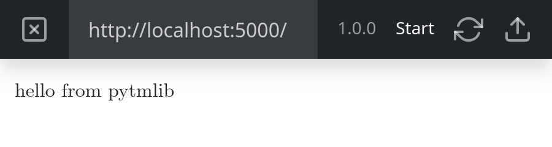
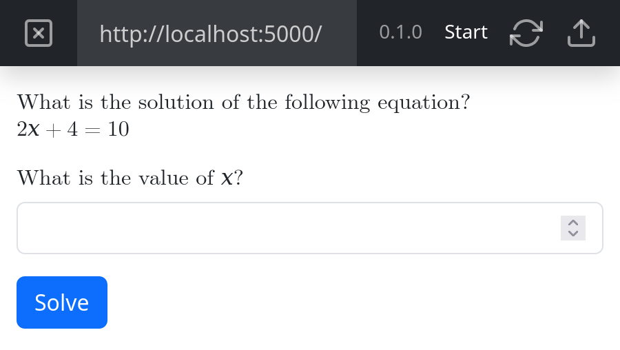

# Quickstart

This page should give you guidance to create your first exercises. The examples on this page are also available in a
[separate repository on GitHub](https://github.com/ofabel/pytm-example). Feel free to check it out and play around.

(first-exercise)=

## First Exercise

After successful [installation of this library](/installation) you can start creating your first exercise. Open your
Python project folder (where your virtual environment folder is located) in your
favourite {term}`IDE` and create a new file named `app.py` with the following content:

```{literalinclude} ../examples/first-exercise/app.py
```

The {meth}`version <pytmlib.abstract_exercise.AbstractExercise.version>` property defines the current version of your
exercise. Use semantic versioning according to the [specification](https://semver.org/spec/v2.0.0.html).

The {meth}`start <pytmlib.abstract_exercise.AbstractExercise.start>` method with the
{meth}`entrypoint <pytmlib.decorators.entrypoint>` decorator defines the entrypoint of your exercise. This method will
be executed, when your exercise starts.

Now, open a new console window, navigate to the python project folder, activate the virtual environment and execute the
following command:

```shell
flask --debug run
```

Open the _Python Tool Manager_ and create a new exercise. Start the preview mode, and you should see the following:



In order to upload your exercise, you need to create a [Dockerfile](https://docs.docker.com/engine/reference/builder/)
at the same level as your `app.py` file is located and add the following content:

```{literalinclude} ../examples/Dockerfile
:language: Dockerfile
```

Now you can upload your first exercise.

```{warning}
Be aware, that the Python Tool Manager doesn't store old versions of your code. You are responsible to create backups.
It's strongly recommended to store your changes in a {term}`VCS` like [Git](https://docs.github.com/en/get-started/getting-started-with-git).
```

(input-fields)=

## Add Input Fields

In order to create a dynamic exercise, we need to allow the user to enter data and send it to the exercise Python code.
So replace the `app.py` file of your first exercise from the example above with the following code:

```{literalinclude} ../examples/input-fields/app.py
```

The number field has the name `answer`. The same identifier occurs as parameter in the `solve` method. Field name and
method parameter name have to match in order to use the field's value inside an action. An action is equal to a method
invocation and is represented by a blue button in the user interface:



To control what method is executed after a click on the button, you need to pass a method reference in the invocation of
{meth}`add_action <pytmlib.output.builder.OutputBuilder.add_action>`. You can also pass additional values using keyword
parameters. See the [next chapter](#dynamic-values) for more information on passing parameters.

(dynamic-values)=

## Use Dynamic Values

An exercise with fixed values is not very interesting and fun to solve. Therefore, we need to introduce dynamic values:

```{literalinclude} ../examples/dynamic-values/app.py
```

As we can see in this slightly advanced version of the [second example exercise](#input-fields), the `solve` method has
now three additional parameters namely `m`,`b` and `y`. The values of these parameters are generated in the `start`
method and passed as keyword arguments in the invocation of
{meth}`add_action <pytmlib.output.builder.OutputBuilder.add_action>`.

```{warning}
Keep the following points in mind when passing values from one action to the next:

* All parameters need to be serializeable.
* Only pass primitives, tuples, dictonaries or lists.
* Don't pass objects like e.g. matplotlib figures.
* Don't pass secret values.
```

## Add the Score

All what's left now is to send a grade to the connected {term}`LMS`:

```{literalinclude} ../examples/score/app.py
```

We can transmit a score by invoking the {meth}`add_score <pytmlib.output.builder.OutputBuilder.add_score>` method on the
{class}`OutputBuilder <pytmlib.output.builder.OutputBuilder>` instance.

```{warning}
The invocation of {meth}`add_score <pytmlib.output.builder.OutputBuilder.add_score>` must happen inside the methods 
return statement. Otherwise, the grade will not be sent to the {term}`LMS`.
```

The score is a float value between 0.0 and 1.0. Where 0.0 is the lowest and 1.0 the highest achievable grade.

(add-a-plot)=

## Add a Plot

```{literalinclude} ../examples/plot/app.py
```

## Write Tests

This guide uses [unittest](https://docs.python.org/3/library/unittest.html), the built-in unit test framework of the
Python standard library, because of its simplicity. This way, we don't have to introduce any additional dependency to
the project, and we can start writing unit tests right away. To write a first unit test, create a new file
named `test.py` next to the `venv` folder. We will write a test for the [previous example exercise](#add-a-plot):

```{literalinclude} ../examples/plot/test.py
```

To execute the tests, activate the virtual environment in a new console window and execute the following command:

```shell
python -m unittest
```

You should observe the following output:

```text
.....
--------------------------------------------------------------------
Ran 5 tests in 0.000s

OK
```
